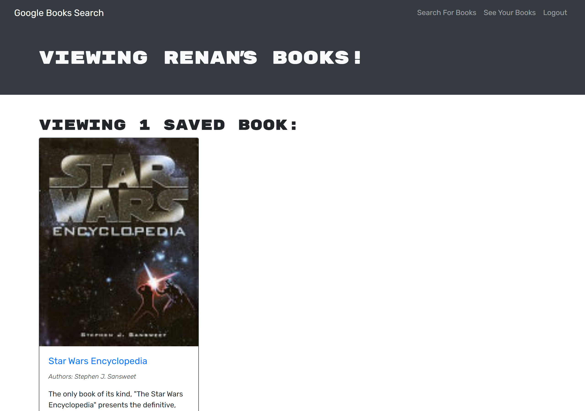

#  Book Search Engine

## Description

A React-based Google Books Search that displays books on user searches. Search for books using the Google Books API by typing in a title and clicking on "Search". The user can view the book which will bring them to the page on Google Books by clicking "View" in the results for the search. Click "Save" to save the book to the database.

This application allows users to search for new books from Google's Book API. Users can log in to save the book they would like to purchase, as well as to remove the books from their library.

## Deployed link 
[Link]( https://google-books123-32524f080868.herokuapp.com/)

## License 
This project is licensed under the MIT license. For more information about the license, go to [License](https://choosealicense.com/licenses/mit/).

## Contribution
If you wish to contribute to this project, feel free to submit a pull request. All contributions are welcome!

Fork the repository. Create a new branch: git checkout -b feature/your-feature. Make your changes and commit them: git commit -m 'Add some feature'. Push to the branch: git push origin feature/your-feature. Submit a pull request.

 ## Questions
 If you have encounter any issues or have any Questions Regarding this Project. Connect with me at

- Email -rs.miranda93@gmail.com 
- Github - [renansm93](https://github.com/renansm93) 
